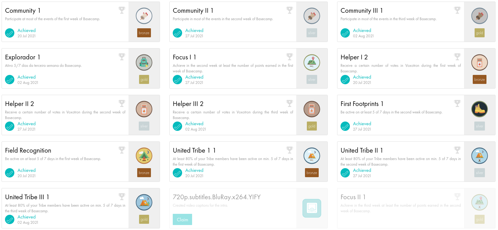

# 42basecamp
Repository created after the école 42 basecamp experience.

Most of codes are in C language, only two of them are in shell script.
Obs.: I didn't complete all the lists and exercises.

## What is 42Basecamp?

Is a 20 days bootcamp and a selection process to study at the world wide software engineering school, more precisely, the São Paulo branch. The basecamp has 13 C lists of project to make, and each one has about 5 to 10 challenges to solve. You only could move on to the next list if you graded at least 50% of the present list.

The basecamp was gamefied, it means that you earn badges to accomplish other challenges, like receiving expressive vote from the other participant as a helpfull peer. There are my bagdes:

## What is école 42 and How it works?

To made to the basecamp, first the participant must had completed two challenges that will test its habilities:
- Memory challenge
- Logic challenge

When approved, some of the participants will have the chance to be in the basecamp and learn shell script and C from the other participants (peer to peer evaluation). 
Navigate to the main site of [école 42]((https://42.fr/en/homepage/), or the [São Paulo branch](https://www.42sp.org.br/) site to see the potential.
The course takes up to a year to be completed and it is totally free.

## My experience

It was insane! 
I couldn't believe that I was learning C without professors, only with my curiousity and my friend's help. Some days I just wanted to cry my soul out of my body, thinking that code was not for me. But happily I was wrong and I continued until the end, always keep going and delivering the projects. 
And now I continue studying, but now as a cadet, a properly student at école 42.
